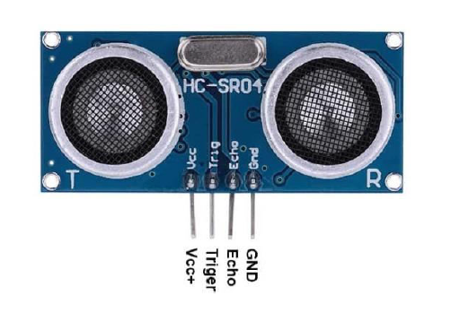
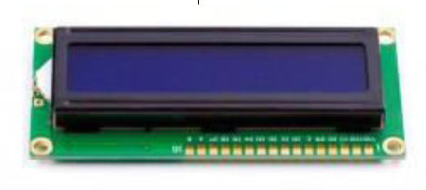

## Distance sensor
The purpose of this project was to enable distance measurement based on the HC-SR04 module. The project is build on FRDM-KL05Z NXP development board. The application has been written in C language, Keil uVision 5 was the development environment.

## Components used in the project
- FRDM-KL05Z development board

- HC-SR04 ultrasonic module

- LCD display

## Physical connections between the HC-SR04 module and the board
- Vcc <-> +5V
- Trigger <-> PTA12
- Echo <-> PTB11
- Gnd <-> GND

## Physical connections between the LCD display and the board
- SCL <-> PTB3
- SDA <-> PTB4
- Vcc <-> +5 V
- Gnd <-> GND

## How it works
To start measurement, you need to supply a short 10 us pulse to the trigger input. This pin has been configured in mode 'edge-aligned PWM low-true pulses (set output on match,
clear output on reload)' to achieve mentioned task. After that, impulse appears on the echo input. Pulse width is proportional to measured distance. To measure it, echo pin has
been configured in mode 'input capture, capture on rising and falling edge'. A distance is displayed on the LCD display, in centimeters.

